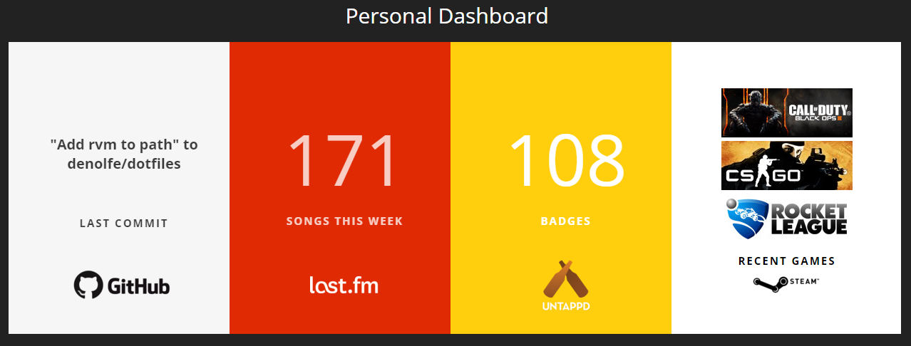

# Personal Dashboard

Dashboard showing data pulled from personal API. If multiple data values available, the panels phase between the data.

- [Mini-Dashing](https://github.com/pushmatrix/mini-dashing) base
- Widgets retrieve data from my [personal api](https://github.com/lukemiles/api.me)
- Widgets: Github, [Last.fm](http://www.last.fm/), [Untappd](https://untappd.com/), and [Steam](http://store.steampowered.com/). Hopefully more soon

### To Do

- Host API (AWS most likely)
- Fix gridster's panels' padding. For some reason, the js function is making the panel widths larger than they should be.
